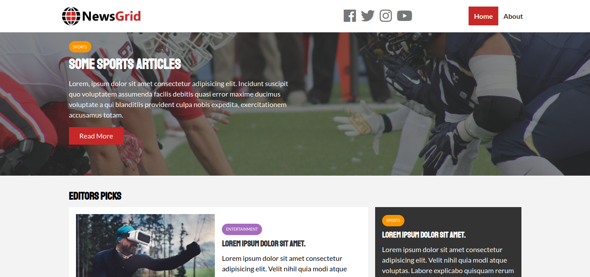

# Modern HTML and CSS From the Beginning (including sass) - News Grid

This is some practice/code along with Brad Traversy in his Udemy Course [Modern HTML & CSS From The Beginning (Including Sass)](https://www.udemy.com/course/modern-html-css-from-the-beginning/). This course is for both beginners and seasoned developers that want to learn how to build responsive websites and user interfaces with modern HTML5 and CSS3+ technologies like Flexbox and CSS Grid as well as the Sass pre-compiler.

## Table of contents

- [Overview](#overview)
  - [The challenge](#the-challenge)
  - [Screenshot](#screenshot)
  - [Links](#links)
- [My process](#my-process)
  - [Built with](#built-with)

## Overview

### The challenge

Users should be able to:

- View the optimal layout depending on their device's screen size
- See hover and focus states for interactive elements
- Set the grid layout

### Screenshot

### Links

- [Solution](https://github.com/mahdipratama/NewsGrid)
- [Live version](https://willowy-melba-1b497c.netlify.app/index.html)

## My process

### Built with

- Semantic HTML5 markup
- CSS custom properties
- Flexbox
- CSS Grid
- Sass/scss
- Mobile-first workflow
